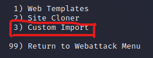

# Phishing para captura de senhas do Facebook

### Ferramentas

- Kali Linux
- setoolkit

### Configurando o Phishing no Kali Linux

Etapa 1: Acesso root: ``` sudo su ```  
Etapa 2: Iniciando o setoolkit: ``` setoolkit ```  
Etapa 3: Tipo de ataque: ``` Social-Engineering Attacks ```  
Etapa 4: Vetor de ataque: ``` Web Site Attack Vectors ```  
Etapa 5: Método de ataque: ```Credential Harvester Attack Method ```  
Etapa 6: Método de ataque: ``` Site Cloner ```  
Etapa 7: Obtendo o endereço da máquina: ``` ifconfig ```  
Etapa 8: Inserir URL para clone: http://www.facebook.com  

### Resutados Sem a proteção do Facebook


É importante saber que sites bastantes conhecidos atualmente contém diversas proteções rígidas contra qualquer script que seja malicioso, para isso temos que dar uma volta por cima deles...  
### Contornando a proteção do Facebook

Quando a clonagem de site não é bem-sucessida , podemos utilizar outra maneira através do ``` Custom Import ``` oferecida na 6ª etapa do nosso ataque.  


Essa opção nos permite, no lugar de uma URL, utilizar um arquivo ``` html ``` da nossa própria máquina para utilização do ataque.  
Portanto, é necessário efetuar alguns "malabarismos" para um phishing limpo e eficiente.  

#### Salvando a página do Facebook

Primeira coisa a se fazer é salvar a página do site oficial.  
Com o botão direito do mouse, dentro do site, é possível efetuar o download.  


Nesse momento é importante tomar cuidado, pois é necessário salvar o arquivo com o nome index.html , pois o setoolkit reconhece apenas o nome padronizado de arquivos html.  


Após salvar, precisamos adquirir o ID do botão de Login.  
Pressione F12 dentro da página e pesquise "button", pressione ENTER até encontrar button ID no início da linha de comandos.  


Depois disso é necessário anotar o ID.  

#### Configurando o arquivo html

Para maior eficiência do nosso ataque, podemos melhorar a página que nós salvamos.  
Ao abrir a página salva, veremos que a página está feia e nada atrativa, o que faz com que o nosso alvo desconfie que seja um site verdadeiro, temos que corrigir isso para aumentar nossas acertividades.  
O motivo disso acontecer é que ao baixarmos a página, elementos do ``` CSS ``` não são iniciados corretamente, faremos uma cópia do código-fonte original e colaremos dentro do código do nosso arquivo.  


